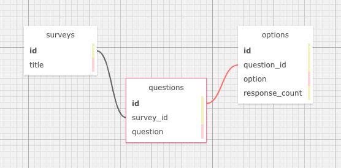

# _Survey Soiree_

### By _**Jo Miller & Micah Olson**_

#### _This project was created solely for the education of the author(s) and is not in a complete or portfolio-ready state. It should not be considered representative of professional work._

[Epicodus](https://www.epicodus.com/) - [Ruby and Rails](https://www.learnhowtoprogram.com/ruby-and-rails/) <!-- - [Week 4](https://www.learnhowtoprogram.com/ruby-and-rails/ruby-database-basics/database-basics-independent-project) -->

#### Date created: 03/16/2021
---

## Technologies Used

* _Ruby 2.6.5_
* _Rails 6.1.3_
* _Embedded Ruby (ERB)_
* _pg 1.2.3_
* _Webpacker 5.2.1_
* _jQuery Rails 4.4.0_
* _Rspec Rails 5.0.0_
* _Pry 0.14.0_
* _Byebug 11.1.3_
* _PostgreSQL 13.2_
* _Bundler 2.2.11_
* _Puma 5.2.2_
* _Launchy 2.5.0_
* _Bootstrap-Sass 3.4.1_
* _git 2.30.0_
---

## Description

_Rails with Active Record: Survey_  
An app that lets people design and take surveys incorporating the following user stories:

* As a survey designer, I want to create a new survey, so that I can get people's opinion on important matters. 
* As a survey designer, I want to add questions to my survey, so that I can find out what people think about various topics.
* As a survey designer, I want to update and delete surveys and questions, in case I change my mind about something.  

## Database Schema
The database for this application has the following tables and relationships:

---

## Requirements
* You will need to use your system's **terminal emulator** to setup and locally use this application.
* `PostgreSQL 12.6` is **required** to manage this application's database ([how to install PostgreSQL 12.6](https://www.learnhowtoprogram.com/ruby-and-rails/getting-started-with-ruby/installing-postgres)).
* You **must** have `Ruby 2.6.5` installed to be able to launch this application ([how to install Ruby 2.6.5](https://www.learnhowtoprogram.com/ruby-and-rails/getting-started-with-ruby/installing-ruby)).

---

## Setup/Installation

* To clone this directory, navigate in your terminal to the desired location of the project and run command `git clone https://github.com/joanna-miller/survey-soiree.git`
* Navigate to top level of the directory with command `cd survey_soiree`
* To install bundler for managing gems run command `gem install bundler`
* To install gems into the project run command `bundle install`
* To use Visual Studio Code to edit this project, follow install instructions [here](https://code.visualstudio.com/).
* To enable command `code`, open VS Code, click on View > Command Palette, type in "shell command", and click on "Shell Command: Install 'code' command in PATH"
* Now, from your terminal, in the project's top level directory, you can run command `code .` to open project in VS Code.
* Launch PostgreSQL to run a persistent database management server `postgres`
* To recreate database, in the root directory of your terminal run command `rake build[survey_soiree]`
* To run tests using rspec, run command `rspec`
* To run a live server, from the root level of the project directory in your terminal, run command `rails server`
* To interact with application, navigate to http://localhost:3000/ in a web browser.
* Exit live server, press Ctrl+C in your terminal

---

## License

[MIT](LICENSE.txt)

---

## Contact Information

* _Contact Jo via [Email](mailto:joannadawnmiller@gmail.com) or [LinkedIn](https://www.linkedin.com/in/jomillerde/), or check out her [Github](https://github.com/joanna-miller)._
* _Contact Micah via [Email](mailto:micah.olson@protonmail.com) or [LinkedIn](https://www.linkedin.com/in/micah-lewis-olson/), or check out his [Github](https://github.com/MicahOlson)._
